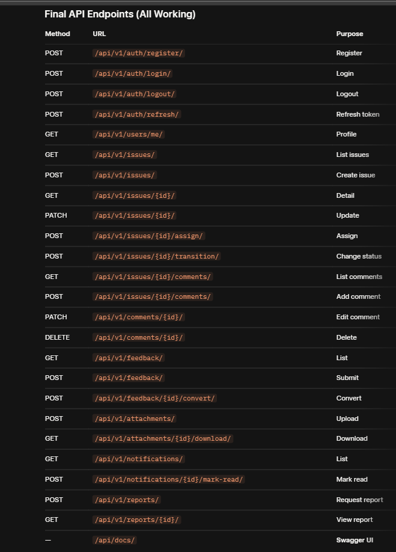

# CFITP – Backend

Django 5 + DRF backend for client feedback & issue tracking.

---

## Features
- Role-based access: `client`, `staff`, `manager`, `admin`  
- JWT auth (SimpleJWT)  
- Issue workflow + history  
- Threaded comments with @mentions → notifications  
- Feedback → Issue conversion  
- File attachments (local / S3-ready)  
- In-app + email notifications (Celery)  
- Async CSV/PDF reports  
- Swagger UI: `/api/docs/`  
- Full test suite + `seed.py`

---

## Folder Structure


---

## Local Setup (Pure Python)

```bash
git clone https://github.com/practicmakesperfact/CFITP_backend.git
cd CFITP_backend

python -m venv .venv
source .venv/bin/activate
pip install -r requirements.txt

##PostgreSQL
CREATE DATABASE cfitp_db;
CREATE USER cfitp_user WITH PASSWORD 'yourpass';
GRANT ALL PRIVILEGES ON DATABASE cfitp_db TO cfitp_user;

##Redis (Ubuntu)
bashsudo apt install redis-server -y
sudo service redis-server start

##.env
envSECRET_KEY=dev-key-change-in-prod
DEBUG=True
DB_NAME=cfitp_db
DB_USER=cfitp_user
DB_PASSWORD=yourpass
DB_HOST=localhost
DB_PORT=5432
REDIS_URL=redis://localhost:6379/1
EMAIL_BACKEND=django.core.mail.backends.console.EmailBackend

##Run
```bash
python manage.py makemigrations
python manage.py migrate
python seed.py
python manage.py runserver

##Celery (new terminal)
```bash
celery -A cf_celery_config worker -l info

##Test
```bash
python manage.py test

##Seed Data
```bash
python seed.py



## 🧠 Project Diagrams

### Entity Relationship Diagram


### Class Diagram

